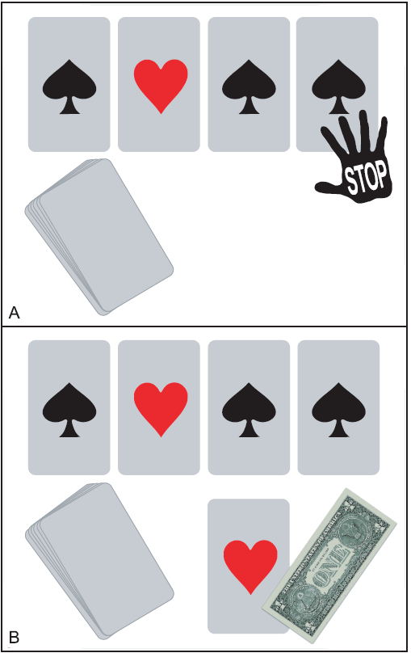

# Finding the winning strategy in a card game

<h1><strong>Problem Statement</strong></h1>

In front of you is a shuffled deck of cards. All 52 cards lie face down. Half the cards are red, and half are black. You will proceed to flip over cards one by one. If the last card you flip over is red, you win a dollar. Otehrwise, you'll lose a dollar.

You can ask to halt the game at any time. Once you say "Halt", I wil, flip over the next card and end the game. That last card will serve as a final card. You will win a dollar if it's red.

What is your best aproach to winning this game?

<h2>Overview</h2>

to adress the problem at hand, we will need to know how to

<ol>
    <li>Compute the probabilities of observable events using sample space analysis.</li>
    <li>Plot the probabilities of events across a range of interval values.</li>
    <li>Simulate random processes, such as coin flips and card shuffling, using Python.</li>
    <li>Evaluate our confidence in decisions drawn from simulations using confidence intervals</li>
</ol>
    